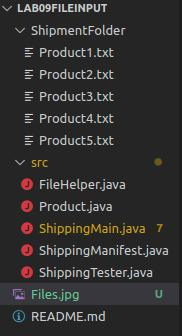

# Lab 09 - File Input
This lab will focus upon String Manipulation and File Input. If you need to brush up on these topics, a small section will be at the lower portion of this document to catch you up on today's topics!

When downloading this program for your use, make sure to download or pull from the [GitHub](https://github.com/CSU-CompSci-CS163-4/Lab09FileInput) to ensure that you have the correct file hierarchy/format needed for this program. For instance, your files should look like this:  

(Don't mind the colors, they are for GitHub version control.)

For ease of access, here is the [javadoc](https://www.cs.colostate.edu/~cs163/javadoc/lab09/package-summary.html).

## Pre-Step: Walkthrough
Before beginning this assignment, it is highly recommended to start in `ShippingMain`'s `main` function and try to walkthrough the program. The `Product` and `ShippingManifest` classes are provided as containers for data, they also have their own methods so it will help to check out those classes.

## Step 1: Compilation
As with all Tuesday labs, you should try to compile and run the program. You can try this by running the `ShippingMain.java` file, you will see that some gibberish is printed because we are missing some code in two methods in `ShippingMain.java`. After your efforts, this gibberish should be readable and the App should receive commands and use them!

## Step 2: Self-Explanation
There will be two methods within the `ShippingMain` class for you to self explain and complete. The javadoc will help you formulate and create your self-explanation for these methods. These methods are difficult to explain and create, so it may be of some use to pseudocode along side your actual self-explanation.

Whether you believe your self-explanation is correct or not, try to implement the method based upon it. If you see any changes that are needed apply them to both your self-explanation and code.

## Step 3: Implementation
This step is just to move on to actually implementing your code within your proposed self-explanation. As previously stated, try to implement based off of your explanation, and if you must change something from the explanation, change that too!

## Step 4: Testing
Once you have completed implementing, try to test your `createProduct(Scanner)` method using the provided `ShippingTester` file. There is only one method provided to test this method. If you are so inclined to create more tests to verify it works properly, go ahead it is encouraged!
For testing the next method you implemented, `go(Scanner, ShippingManifest)`, this is up to you to test manually. So try to run through your program a couple of times before turning it in.

## Step 5: Turning In
Make sure to submit your `ShippingMain.java` file to zyBooks and then show your TA your self-explanation and pseudo-code if you did it. 

# Additional Information
## String Manipulation

## File Input